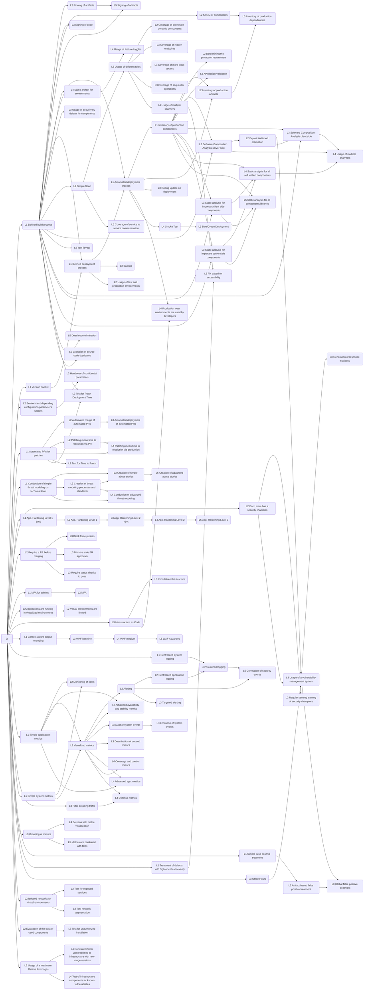

## DSOMM Activity Dependencies

The activities in this DSOMM Model have the following dependencies.

```mermaid
graph LR

0(L2 Pinning of artifacts)
1(L1 Defined build process)
2(L2 SBOM of components)
3(L3 Signing of code)
4(L5 Signing of artifacts)
5(L1 Automated deployment process)
6(L1 Defined deployment process)
7(L1 Version control)
8(L1 Inventory of production components)
9(L2 Inventory of production artifacts)
10(L3 Handover of confidential parameters)
11(L2 Environment depending configuration parameters secrets)
12(L3 Inventory of production dependencies)
13(L3 Rolling update on deployment)
14(L4 Same artifact for environments)
15(L4 Usage of feature toggles)
16(L5 Blue/Green Deployment)
17(L4 Smoke Test)
18(L2 Automated merge of automated PRs)
19(L1 Automated PRs for patches)
20(L3 Automated deployment of automated PRs)
21(L3 Creation of simple abuse stories)
22(L1 Conduction of simple threat modeling on technical level)
23(L3 Creation of threat modeling processes and standards)
24(L4 Conduction of advanced threat modeling)
25(L5 Creation of advanced abuse stories)
26(L2 Regular security training of security champions)
27(L2 Each team has a security champion)
28(L2 Determining the protection requirement)
29(L2 App. Hardening Level 1)
30(L1 App. Hardening Level 1 50%)
31(L3 App. Hardening Level 2 75%)
32(L4 App. Hardening Level 2)
33(L5 App. Hardening Level 3)
34(L3 Block force pushes)
35(L2 Require a PR before merging)
36(L3 Dismiss stale PR approvals)
37(L3 Require status checks to pass)
38(L2 Backup)
39(L2 MFA)
40(L1 MFA for admins)
41(L2 Usage of test and production environments)
42(L2 Virtual environments are limited)
43(L2 Applications are running in virtualized environments)
44(L3 Immutable infrastructure)
45(L3 Infrastructure as Code)
46(L3 Limitation of system events)
47(L3 Audit of system events)
48(L3 Usage of security by default for components)
49(L3 WAF baseline)
50(L1 Context-aware output encoding)
51(L4 Production near environments are used by developers)
52(L4 WAF medium)
53(L5 WAF Advanced)
54(L2 Centralized application logging)
55(L2 Alerting)
56(L3 Visualized logging)
57(L1 Centralized system logging)
58(L5 Correlation of security events)
59(L2 Visualized metrics)
60(L2 Monitoring of costs)
61(L1 Simple application metrics)
62(L1 Simple system metrics)
63(L3 Advanced availability and stability metrics)
64(L3 Deactivation of unused metrics)
65(L3 Targeted alerting)
66(L4 Advanced app. metrics)
67(L4 Coverage and control metrics)
68(L4 Defense metrics)
69(L3 Filter outgoing traffic)
70(L4 Screens with metric visualization)
71(L3 Grouping of metrics)
72(L5 Metrics are combined with tests)
73(L2 Patching mean time to resolution via PR)
74(L3 Generation of response statistics)
75(L3 Usage of a vulnerability management system)
76(L4 Patching mean time to resolution via production)
77(L2 Artifact-based false positive treatment)
78(L1 Simple false positive treatment)
79(L3 Fix based on accessibility)
80(L1 Treatment of defects with high or critical severity)
81(L3 Global false positive treatment)
82(L2 Exploit likelihood estimation)
83(L3 Office Hours)
84(L2 Coverage of client side dynamic components)
85(L2 Usage of different roles)
86(L2 Simple Scan)
87(L3 Coverage of hidden endpoints)
88(L3 Coverage of more input vectors)
89(L3 Coverage of sequential operations)
90(L4 Usage of multiple scanners)
91(L5 Coverage of service to service communication)
92(L2 Test for exposed services)
93(L2 Isolated networks for virtual environments)
94(L2 Test network segmentation)
95(L3 Test for unauthorized installation)
96(L2 Evaluation of the trust of used components)
97(L2 Software Composition Analysis server side)
98(L2 Test for Time to Patch)
99(L2 Test libyear)
100(L3 API design validation)
101(L3 Software Composition Analysis client side)
102(L3 Static analysis for important client side components)
103(L3 Static analysis for important server side components)
104(L3 Test for Patch Deployment Time)
105(L4 Static analysis for all self written components)
106(L4 Usage of multiple analyzers)
107(L5 Dead code elimination)
108(L5 Exclusion of source code duplicates)
109(L5 Static analysis for all components/libraries)
110(L4 Correlate known vulnerabilities in infrastructure with new image versions)
111(L2 Usage of a maximum lifetime for images)
112(L4 Test of infrastructure components for known vulnerabilities)


1 --> 0
1 --> 2
1 --> 3
1 --> 4
1 --> 5
1 --> 6
1 --> 14
1 --> 48
1 --> 86
1 --> 97
1 --> 99
1 --> 101
1 --> 102
1 --> 103
1 --> 104
1 --> 107
1 --> 108
0 --> 4
6 --> 5
6 --> 38
6 --> 41
7 --> 6
5 --> 8
5 --> 9
5 --> 13
5 --> 51
5 --> 17
8 --> 9
8 --> 28
8 --> 79
8 --> 97
8 --> 100
8 --> 101
8 --> 102
8 --> 103
8 --> 105
8 --> 109
11 --> 10
9 --> 12
2 --> 12
14 --> 15
17 --> 16
19 --> 18
19 --> 73
19 --> 76
19 --> 98
19 --> 104
18 --> 20
22 --> 21
22 --> 23
22 --> 24
23 --> 21
23 --> 24
21 --> 25
27 --> 26
27 --> 75
30 --> 29
29 --> 31
31 --> 32
32 --> 33
35 --> 34
35 --> 36
35 --> 37
40 --> 39
43 --> 42
45 --> 44
45 --> 51
47 --> 46
50 --> 49
49 --> 52
52 --> 53
55 --> 54
55 --> 58
55 --> 65
57 --> 56
54 --> 56
56 --> 58
59 --> 55
59 --> 63
59 --> 47
59 --> 64
59 --> 66
59 --> 67
59 --> 68
61 --> 60
61 --> 59
61 --> 63
61 --> 66
62 --> 60
62 --> 59
69 --> 68
71 --> 70
71 --> 72
75 --> 74
75 --> 81
73 --> 76
78 --> 77
80 --> 79
77 --> 81
82 --> 75
82 --> 101
83 --> 75
85 --> 84
85 --> 87
85 --> 88
85 --> 89
85 --> 90
86 --> 85
86 --> 91
93 --> 92
93 --> 94
96 --> 95
97 --> 82
97 --> 106
102 --> 105
102 --> 109
103 --> 105
103 --> 109
101 --> 106
105 --> 106
111 --> 110
111 --> 112

O --> 1
O --> 7
O --> 11
O --> 19
O --> 22
O --> 27
O --> 30
O --> 35
O --> 40
O --> 43
O --> 45
O --> 50
O --> 57
O --> 61
O --> 62
O --> 69
O --> 71
O --> 78
O --> 80
O --> 83
O --> 93
O --> 96
O --> 111
```
