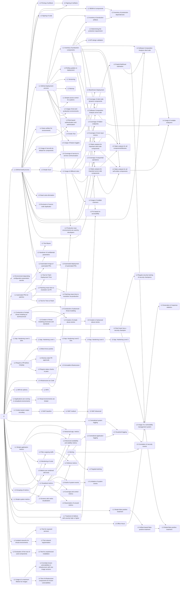

```mermaid

graph LR

0(L2 Pinning of artifacts)
1(L1 Defined build process)
2(L2 SBOM of components)
3(L5 Signing of artifacts)
4(L3 Signing of code)
5(L5 Blue/Green Deployment)
6(L4 Smoke Test)
7(L1 Defined deployment process)
8(L3 Handover of confidential parameters)
9(L2 Environment depending configuration parameters secrets)
10(L2 Inventory of production artifacts)
11(L1 Inventory of production components)
12(L3 Inventory of production dependencies)
13(L3 Rolling update on deployment)
14(L4 Same artifact for environments)
15(L4 Usage of feature toggles)
16(L3 Automated deployment of automated PRs)
17(L2 Automated merge of automated PRs)
18(L1 Automated PRs for patches)
19(L4 Conduction of advanced threat modeling)
20(L1 Conduction of simple threat modeling on technical level)
21(L3 Creation of threat modeling processes and standards)
22(L5 Creation of advanced abuse stories)
23(L3 Creation of simple abuse stories)
24(L2 Regular security training of security champions)
25(L2 Each team has a security champion)
26(L2 Determining the protection requirement)
27(L2 App. Hardening Level 1)
28(L1 App. Hardening Level 1 50%)
29(L4 App. Hardening Level 2)
30(L3 App. Hardening Level 2 75%)
31(L5 App. Hardening Level 3)
32(L3 Block force pushes)
33(L2 Require a PR before merging)
34(L3 Dismiss stale PR approvals)
35(L3 Require status checks to pass)
36(L1 Versioning)
37(L2 Backup)
38(L3 Immutable infrastructure)
39(L3 Infrastructure as Code)
40(L3 Limitation of system events)
41(L3 Audit of system events)
42(L2 MFA)
43(L1 MFA for admins)
44(L4 Production near environments are used by developers)
45(L3 Role based authentication and authorization)
46(L1 Simple access control for systems)
47(L3 Usage of security by default for components)
48(L2 Usage of test and production environments)
49(L2 Virtual environments are limited)
50(L2 Applications are running in virtualized environments)
51(L5 WAF Advanced)
52(L4 WAF medium)
53(L3 WAF baseline)
54(L1 Context-aware output encoding)
55(L2 Centralized application logging)
56(L2 Alerting)
57(L5 Correlation of security events)
58(L3 Visualized logging)
59(L1 Centralized system logging)
60(L4 Advanced app. metrics)
61(L1 Simple application metrics)
62(L2 Visualized metrics)
63(L3 Advanced availability and stability metrics)
64(L4 Coverage and control metrics)
65(L3 Deactivation of unused metrics)
66(L4 Defense metrics)
67(L3 Filter outgoing traffic)
68(L5 Metrics are combined with tests)
69(L3 Grouping of metrics)
70(L2 Monitoring of costs)
71(L1 Simple system metrics)
72(L4 Screens with metric visualization)
73(L3 Targeted alerting)
74(L3 Generation of response statistics)
75(L3 Usage of a vulnerability management system)
76(L2 Patching mean time to resolution via PR)
77(L4 Patching mean time to resolution via production)
78(L2 Artifact-based false positive treatment)
79(L1 Simple false positive treatment)
80(L3 Fix based on accessibility)
81(L1 Treatment of defects with severity high or higher)
82(L3 Global false positive treatment)
83(L3 Exploit likelihood estimation)
84(L3 Office Hours)
85(L2 Coverage of client side dynamic components)
86(L2 Usage of different roles)
87(L3 Coverage of hidden endpoints)
88(L3 Coverage of more input vectors)
89(L3 Coverage of sequential operations)
90(L5 Coverage of service to service communication)
91(L2 Simple Scan)
92(L4 Usage of multiple scanners)
93(L2 Test for exposed services)
94(L2 Isolated networks for virtual environments)
95(L3 Test for unauthorized installation)
96(L2 Evaluation of the trust of used components)
97(L2 Test network segmentation)
98(L3 API design validation)
99(L5 Dead code elimination)
100(L5 Exclusion of source code duplicates)
101(L2 Software Composition Analysis server side)
102(L3 Software Composition Analysis client side)
103(L5 Static analysis for all components/libraries)
104(L3 Static analysis for important client side components)
105(L3 Static analysis for important server side components)
106(L4 Static analysis for all self written components)
107(L3 Test for Patch Deployment Time)
108(L2 Test for Time to Patch)
109(L2 Test libyear)
110(L4 Usage of multiple analyzers)
111(L4 Correlate known vulnerabilities in infrastructure with new image versions)
112(L2 Usage of a maximum lifetime for images)
113(L4 Test of infrastructure components for known vulnerabilities)


1 --> 0
1 --> 2
1 --> 3
1 --> 4
1 --> 7
1 --> 14
1 --> 45
1 --> 47
1 --> 91
1 --> 99
1 --> 100
1 --> 102
1 --> 101
1 --> 104
1 --> 105
1 --> 107
1 --> 109
0 --> 3
6 --> 5
9 --> 8
7 --> 10
7 --> 11
7 --> 13
7 --> 36
7 --> 37
7 --> 44
7 --> 45
7 --> 46
7 --> 48
7 --> 6
11 --> 10
11 --> 26
11 --> 80
11 --> 98
11 --> 102
11 --> 101
11 --> 103
11 --> 106
11 --> 104
11 --> 105
10 --> 12
2 --> 12
14 --> 15
17 --> 16
18 --> 17
18 --> 76
18 --> 77
18 --> 107
18 --> 108
20 --> 19
20 --> 23
20 --> 21
21 --> 19
21 --> 23
23 --> 22
25 --> 24
25 --> 75
28 --> 27
30 --> 29
27 --> 30
29 --> 31
33 --> 32
33 --> 34
33 --> 35
39 --> 38
39 --> 44
41 --> 40
43 --> 42
50 --> 49
52 --> 51
54 --> 53
53 --> 52
56 --> 55
56 --> 57
56 --> 73
58 --> 57
59 --> 58
55 --> 58
61 --> 60
61 --> 63
61 --> 70
61 --> 62
62 --> 60
62 --> 63
62 --> 56
62 --> 41
62 --> 64
62 --> 65
62 --> 66
67 --> 66
69 --> 68
69 --> 72
71 --> 70
71 --> 62
75 --> 74
75 --> 82
76 --> 77
79 --> 78
81 --> 80
78 --> 82
83 --> 75
83 --> 102
84 --> 75
86 --> 85
86 --> 87
86 --> 88
86 --> 89
86 --> 92
91 --> 90
91 --> 86
94 --> 93
94 --> 97
96 --> 95
101 --> 83
101 --> 110
104 --> 103
104 --> 106
105 --> 103
105 --> 106
102 --> 110
106 --> 110
112 --> 111
112 --> 113

O --> 1
O --> 9
O --> 18
O --> 20
O --> 25
O --> 28
O --> 33
O --> 39
O --> 43
O --> 50
O --> 54
O --> 59
O --> 61
O --> 67
O --> 69
O --> 71
O --> 79
O --> 81
O --> 84
O --> 94
O --> 96
O --> 112
```
